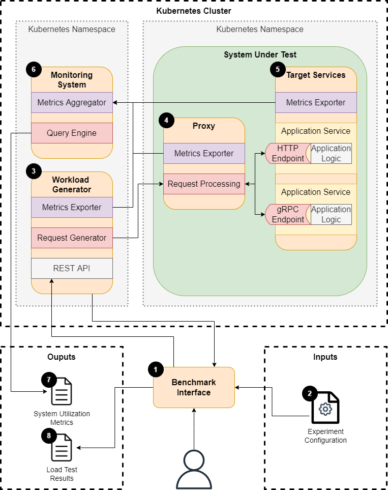

# Mesh Bench

This repository contains the artifacts as produced during my [thesis](https://github.com/RichardBieringa/thesis).

⚠️ **Warning**: This was not designed for production usage in any way, this repository reflected my working directory during my research and was used as such.

This repository simply is there to make make the results and artifacts open-source and available for everyone.

### Project Overview

Below is an overview of the files and directories in this repository and their respective goals.

    ├── data                    # Used by the data extraction scripts in /viz
    ├── manifests               # Contains the Kubernetes manifests
    ├── plots                   # Contains the graphical plots of the experiment data
    ├── results                 # Contains the experiment results
    ├── viz                     # Jupyter notebooks for data visualization and generation
    ├── LICENSE
    ├── README.md
    ├── gc.sh                   # GKE setup script to generate the cluster used
    └── tool-versions.txt       # The output of various tools used and their versions

### Benchmark Architecture

### Service Mesh Systems Evaluated

Below is a list of service mesh systems evaluated, the thesis goes into detail on why I chose to evaluate these specific systems.

| Service Mesh | Site |
| ------ | ------ |
| Istio | [link](https://istio.io/) |
| Linkerd | [link](https://linkerd.io/) |
| Traefik  Mesh | [link](https://traefik.io/traefik-mesh/) |
| Cilium | [link](https://cilium.io/) |
